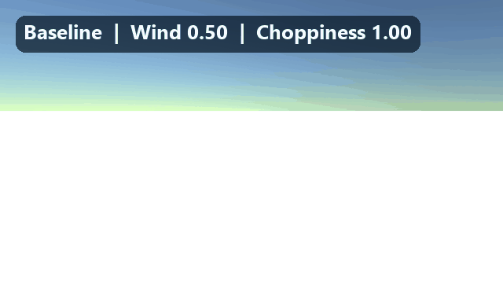
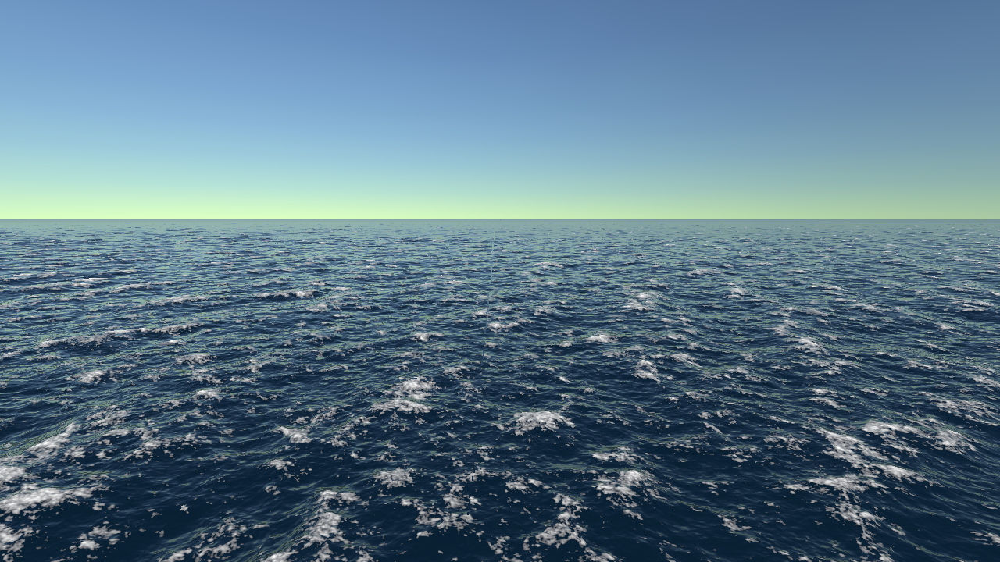
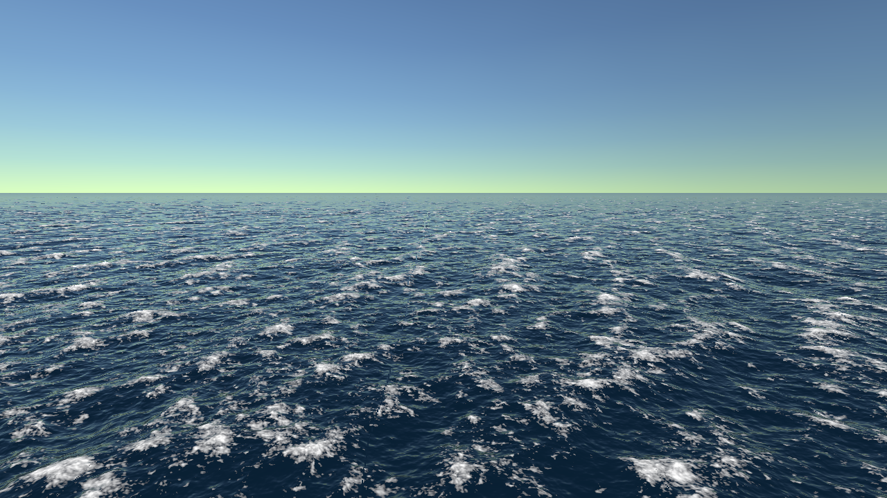
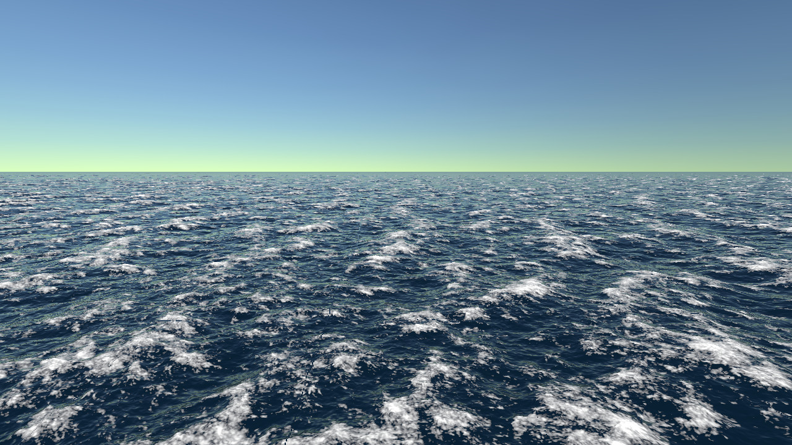
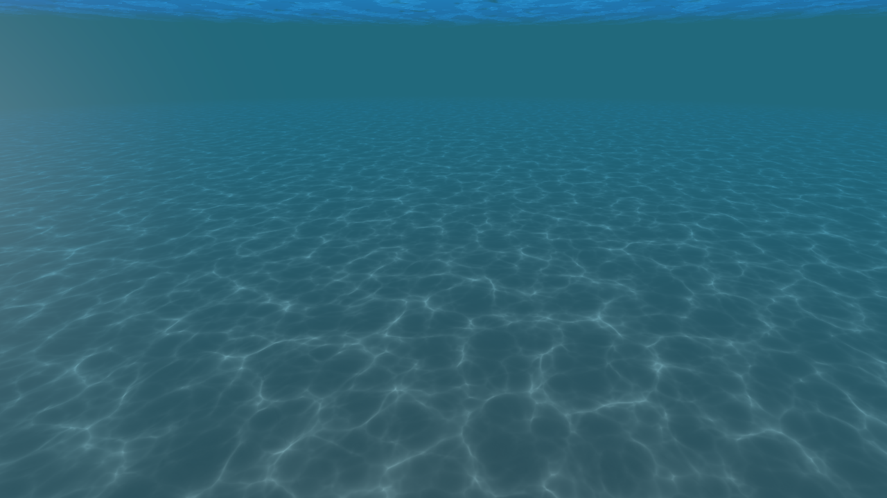
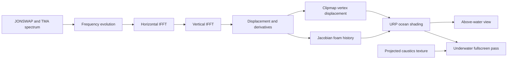
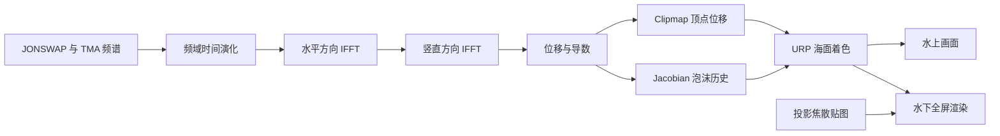

# FFT Ocean for Unity URP

A portfolio-oriented GPU ocean simulation built for Unity 2022.3 LTS and Universal Render Pipeline 14

This repository is an independently implemented learning project based on the ocean-spectrum concepts described by Jerry Tessendorf and modern real-time water rendering practice. It is not a source copy of the reference repositories listed below

## Demo

The following capture runs the real Unity scene and switches between three restrained parameter presets. The labels show the values applied at runtime



[Download the 1280 x 720 MP4 version](docs/media/fft-ocean-parameter-demo.mp4)

| Baseline | Sharper crests | Stronger wind |
|---|---|---|
|  |  |  |

Underwater rendering uses the same animated FFT surface, with depth-aware absorption, scattering, the waterline, and two-layer projected caustics

The underwater preview uses a light-shaft strength of `0.12` and a gentle distant-water fade to preserve the contrast of the caustic pattern



## Highlights

- GPU spectral ocean simulation using JONSWAP with TMA finite-depth correction
- Three non-overlapping spectral cascades for long, medium, and short waves
- Horizontal and vertical inverse FFT passes in a compute shader
- Choppy horizontal displacement and derivative-based surface normals
- Temporal Jacobian compression history for coherent breaking-wave foam
- Camera-following eight-level clipmap mesh for a large visible ocean
- URP Fresnel reflection, main-light glitter, subsurface tint, and distance roughness
- Double-sided surface rendering with underwater total internal reflection
- Fullscreen underwater absorption, scattering, waterline, distortion, and light shafts
- Projected two-layer caustics with symmetric relative motion
- Runtime surface-height sampling for stable underwater transitions

## Requirements

- Unity `2022.3.62f2`
- Universal Render Pipeline `14.0.12`
- A GPU with compute-shader support
- Windows and Direct3D 11 are the validated development configuration

## Quick start

1. Clone the repository
2. Open the repository folder as a Unity project
3. Open `Assets/Scenes/FFT-Ocean.unity`
4. Enter Play Mode
5. Hold the right mouse button to look around

Camera controls:

| Input | Action |
|---|---|
| `W A S D` | Move horizontally |
| `Q / E` | Move down or up |
| Right mouse drag | Look around |
| Left Shift | Fast movement |
| `C` | Toggle cinematic camera motion |

If the scene or materials need to be rebuilt, use `Tools > FFT Ocean > Build Portfolio Scene`

## Core parameters

Select the `FFT Ocean` object and edit `FFTOceanController`

| Parameter | Visual effect | Cost or caveat |
|---|---|---|
| Resolution | Spectral detail per cascade | `256` is the portfolio default; `512` is much more expensive |
| Wind Speed | Moves the spectral peak and changes wave energy | Rebuilds the spectrum |
| Wind Direction | Rotates dominant wave travel | Rebuilds the spectrum |
| Fetch | Controls the distance over which wind builds the sea | Larger values emphasize mature waves |
| Peak Enhancement | Sharpens energy around the JONSWAP peak | High values can look overly regular |
| Spread Blend | Controls directional concentration | Lower values create a more confused sea |
| Swell | Adds directional long-wave character | Best tuned with wind and fetch |
| Choppiness | Scales horizontal displacement | It sharpens profiles but does not add spectral detail |
| Turbulence Recovery | Controls foam-history persistence | Lower values retain breaking foam longer |

The three cascade domains are `250 m`, `17 m`, and `5 m`. Their wavelength bands share boundaries without overlapping, which avoids duplicated energy and reduces regular cross-hatch artifacts

## Rendering pipeline



Detailed implementation notes are in [docs/ARCHITECTURE.md](docs/ARCHITECTURE.md)

## Project layout

```text
Assets/
  FFT-Ocean/
    Compute/       Spectrum, IFFT, displacement, Jacobian history
    Scripts/       Simulation, clipmap, camera, underwater renderer feature, capture runner
    Shaders/       URP ocean surface and underwater fullscreen shaders
    Materials/     Portfolio-ready material presets
    Editor/        Reproducible scene and media-capture builders
  Scenes/
    FFT-Ocean.unity
  Settings/
    URP-HighFidelity.asset
    URP-HighFidelity-Renderer.asset
  Textures/
    caustics_1.png
```

## Source control note

The project was originally developed inside a larger Unity workspace that was tracked with Plastic SCM / Unity Version Control. This repository begins with a single Git import snapshot instead of fabricating historical Git commits. The original changeset summary and the mapping to this export are documented in [docs/SCM_HISTORY.md](docs/SCM_HISTORY.md)

## References

- Jerry Tessendorf, [Simulating Ocean Water](https://people.computing.clemson.edu/~jtessen/reports/papers_files/coursenotes2004.pdf)
- Wave Harmonic, [Crest Ocean System](https://github.com/wave-harmonic/crest)
- Keith Lantz, [Ocean Simulation Part One](https://www.keithlantz.net/2011/10/ocean-simulation-part-one-using-the-discrete-fourier-transform/)
- Gasgiant, [FFT-Ocean](https://github.com/gasgiant/FFT-Ocean), used as a visual and feature reference rather than copied source

## License

No open-source license is granted by this repository. The code and original project assets are provided for portfolio review unless a license is added later

---

# Unity URP FFT 海洋

这是一个面向作品集展示的 GPU 海洋模拟项目，使用 Unity 2022.3 LTS 与 Universal Render Pipeline 14 制作

项目依据 Jerry Tessendorf 的海洋频谱理论和现代实时水体渲染方法独立实现，并没有直接复制下方参考仓库的源码

## 效果演示

下面的动图由真实 Unity 场景自动采集，并依次切换三组较克制的海况参数，左上角标注了运行时实际使用的数值


[下载 1280 x 720 MP4 版本](docs/media/fft-ocean-parameter-demo.mp4)

| 基准海况 | 更锐利的浪尖 | 更强的风浪 |
|---|---|---|
|  |  |  |

水下画面继续使用同一套 FFT 动态水面，并叠加基于深度的吸收、散射、水线与双层投影焦散

水下预览将光束强度设为 `0.12`，配合远景水色渐隐，让焦散花纹保持清晰的对比度


## 主要功能

- 使用 JONSWAP 频谱与 TMA 有限水深修正生成 GPU 海浪
- 三层互不重叠的频谱级联，分别负责长浪、中浪和短浪
- 在 Compute Shader 中执行水平与竖直方向的反向 FFT
- 支持水平 Choppy 位移，并通过导数重建水面法线
- 使用 Jacobian 压缩历史生成连贯的浪尖破碎泡沫
- 八层相机跟随 Clipmap 网格，用较少几何覆盖大范围海面
- URP Fresnel 反射、主光高光、次表面颜色和远距离粗糙度
- 双面水面与水下全反射表现
- 水下吸收、散射、水线、扰动和光束的全屏渲染
- 两层相对偏移且中心稳定的投影焦散
- GPU 水面高度采样，使水上与水下切换更稳定

## 环境要求

- Unity `2022.3.62f2`
- Universal Render Pipeline `14.0.12`
- 支持 Compute Shader 的显卡
- 已验证的开发环境为 Windows 与 Direct3D 11

## 快速运行

1. 克隆仓库
2. 用 Unity 打开仓库根目录
3. 打开 `Assets/Scenes/FFT-Ocean.unity`
4. 进入 Play Mode
5. 按住鼠标右键控制视角

相机操作：

| 输入 | 功能 |
|---|---|
| `W A S D` | 水平移动 |
| `Q / E` | 下潜或上升 |
| 鼠标右键拖动 | 控制视角 |
| 左 Shift | 加速移动 |
| `C` | 开关电影式自动运镜 |

如果场景或材质引用丢失，可执行 `Tools > FFT Ocean > Build Portfolio Scene` 重新生成展示场景

## 核心参数

选择场景中的 `FFT Ocean`，在 `FFTOceanController` 中调整参数

| 参数 | 视觉作用 | 注意事项 |
|---|---|---|
| Resolution | 控制每层频谱的细节量 | 作品集默认值为 `256`，`512` 的计算开销明显更高 |
| Wind Speed | 改变频谱峰值与波浪能量 | 调整后会重新初始化频谱 |
| Wind Direction | 旋转主波传播方向 | 调整后会重新初始化频谱 |
| Fetch | 控制风在海面上持续作用的距离 | 数值越大，海浪越接近充分发展状态 |
| Peak Enhancement | 强化 JONSWAP 峰值 | 过高会让海浪显得规则 |
| Spread Blend | 控制方向集中程度 | 降低后海面方向更混乱 |
| Swell | 增加有方向性的长浪特征 | 建议和风速、Fetch 一起调节 |
| Choppiness | 缩放水平位移 | 会让浪形更尖，但不会增加频谱细节 |
| Turbulence Recovery | 控制泡沫历史消退速度 | 越小，破碎泡沫保留越久 |

三层频谱范围分别是 `250 m`、`17 m` 和 `5 m`。它们的波长范围只共享边界、不重复覆盖，可以避免重复能量并减弱规则的交叉网格感

## 技术流程



更详细的实现说明见 [docs/ARCHITECTURE.md](docs/ARCHITECTURE.md)

## 版本记录说明

这个功能最初在一个同时包含 Boids 的大型 Unity 工程中开发，并使用 Plastic SCM / Unity Version Control 管理。为了避免伪造 Git 开发历史，本仓库从一次真实的导出快照开始。原 SCM 变更摘要与本仓库的对应关系记录在 [docs/SCM_HISTORY.md](docs/SCM_HISTORY.md)

## 许可证

仓库目前没有授予开源许可证。代码和原创项目资源仅用于作品集审阅，后续可以再根据需要添加许可证
